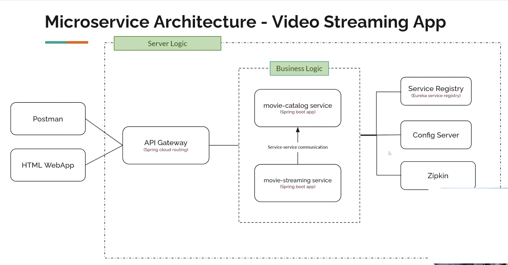

# Video-Streaming-App-Microservices-Spring-Boot

- Built a full fledged microservices based Movie Streaming Application
- Architecture:

    1. Service Registry: A registry where we store the information about all the other services, it itself is a microservice.
    2. movie-catalog-service: Store the metadata about the available movies.
    3. movie-streaming-service: Responsible for streaming the video.
    4. API Gateway: To interact with the users, receives outside requests. Provides abstractions.
    5. Config Server: To control the configurations of all other microservices in a centralized way.
    6. Zipkin: A Tracing tool, collects the logs and provide informatino about the microservices runnign in the app.

