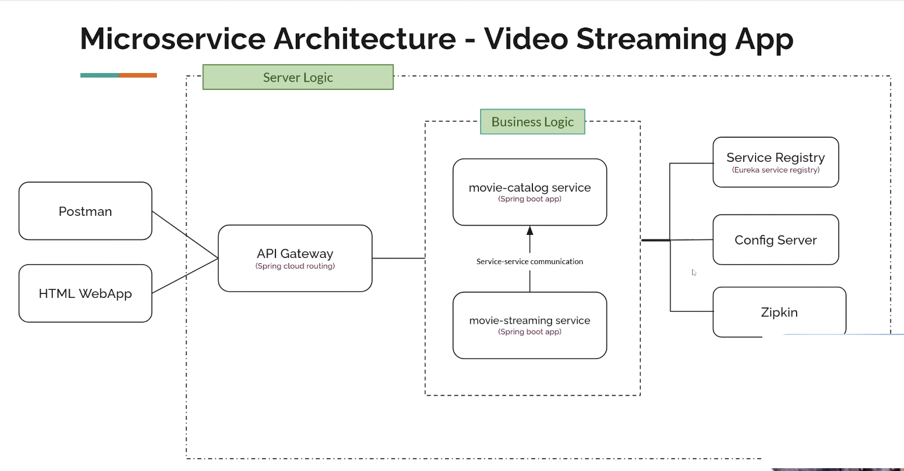
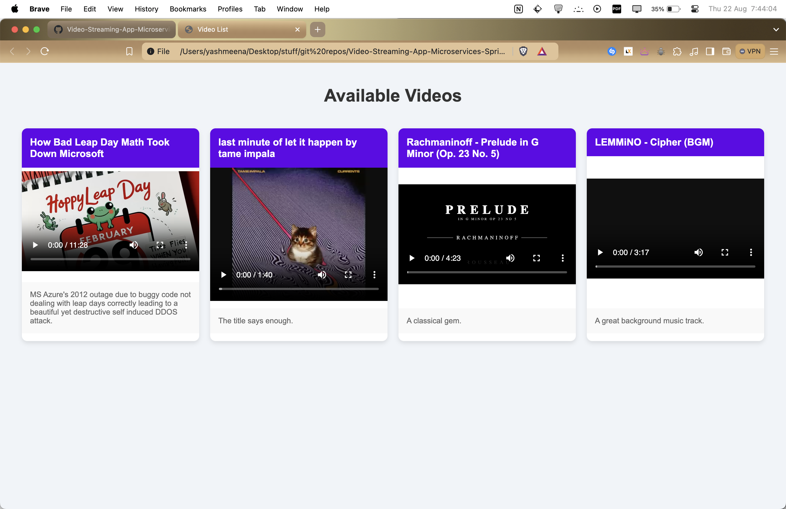
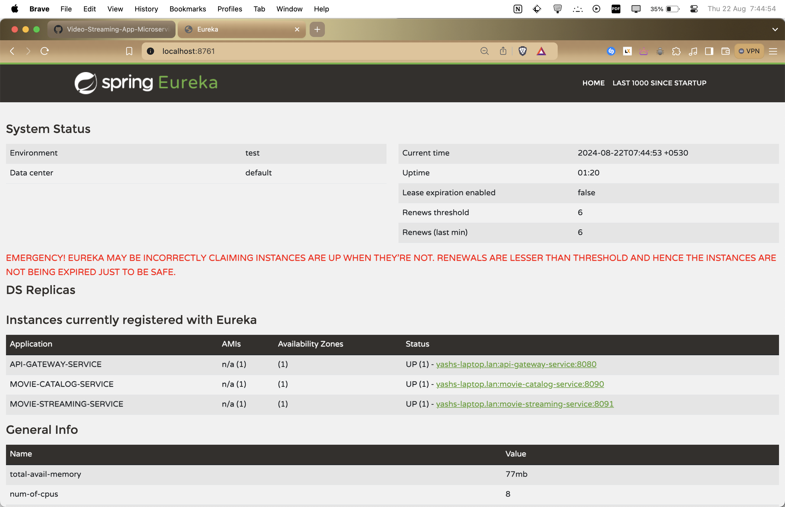

# Video-Streaming-App-Microservices-Spring-Boot

- Built a full fledged microservices based Movie Streaming Application
- Architecture:

    1. Service Registry: A registry where we store the information about all the other services, it itself is a microservice.
    2. movie-catalog-service: Store the metadata about the available movies.
    3. movie-streaming-service: Responsible for streaming the video.
    4. API Gateway: To interact with the users, receives outside requests. Provides abstractions.
    5. Config Server: To control the configurations of all other microservices in a centralized way.
    6. Zipkin: A Tracing tool, collects the logs and provide informatino about the microservices runnign in the app.

Interservice communication is also something to take care of down the line

2024-08-22 06:46:00 -> Finished Project

To run it simply clone the repo, build the project with gradle clean install on each microservice (or write a script for it, i will maybe write one, but its just simple commands nothing complex)
Then populate the mysql server with the following dummy code you may use the below command to send a post request which would fill the metadata of the videos I've put in the assets folder: 
```
curl -X POST http://localhost:8090/movie-info/save \
-H "Content-Type: application/json" \
-d '[
    {
        "name": "How Bad Leap Day Math Took Down Microsoft",
        "description": "MS Azure's 2012 outage due to buggy code not dealing with leap days correctly leading to a beautiful yet destructive self induced DDOS attack.",
        "path": "How Bad Leap Day Math Took Down Microsoft.mp4"
    },
    {
        "name": "last minute of let it happen by tame impala",
        "description": "The title says enough.",
        "path": "last minute of let it happen by tame impala.mp4"
    },
    {
        "name": "Rachmaninoff - Prelude in G Minor (Op. 23 No. 5)",
        "description": "A classical gem.",
        "path": "Rachmaninoff - Prelude in G Minor (Op. 23 No. 5).mp4"
    },
    {
        "name": "LEMMiNO - Cipher (BGM)",
        "description": "A great background music track.",
        "path": "LEMMiNO - Cipher (BGM).mp4"
    }
]'
```


This is the screenshot of the final project:


and these are the services in the service registry:
